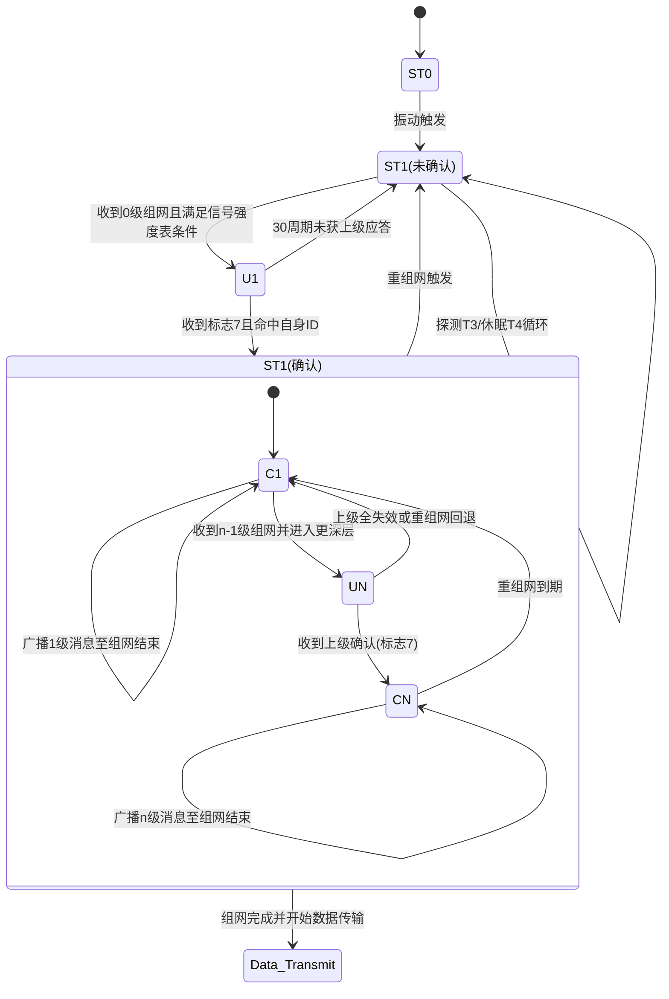
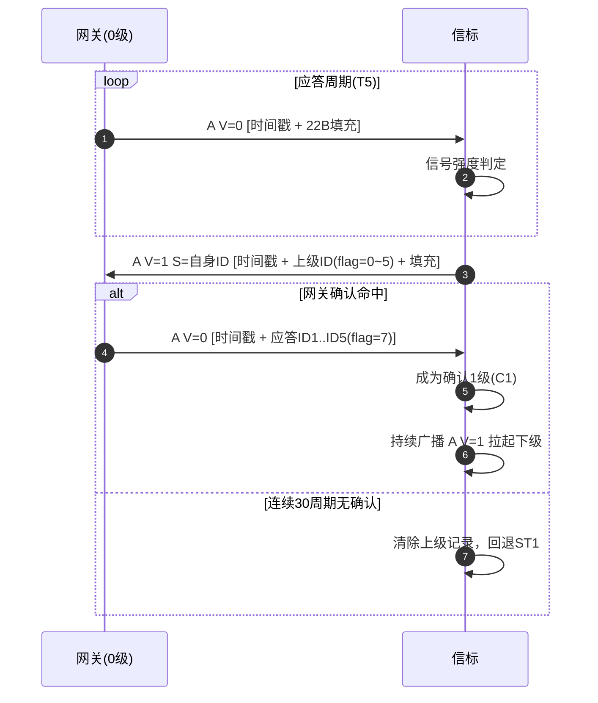
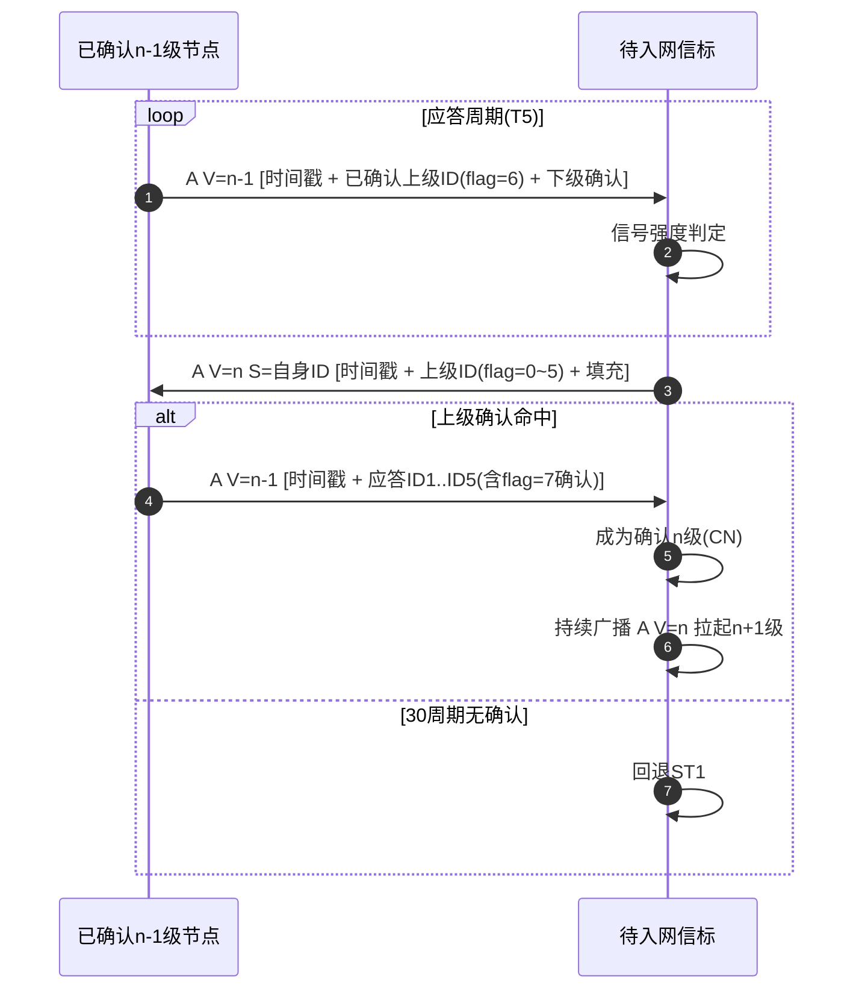
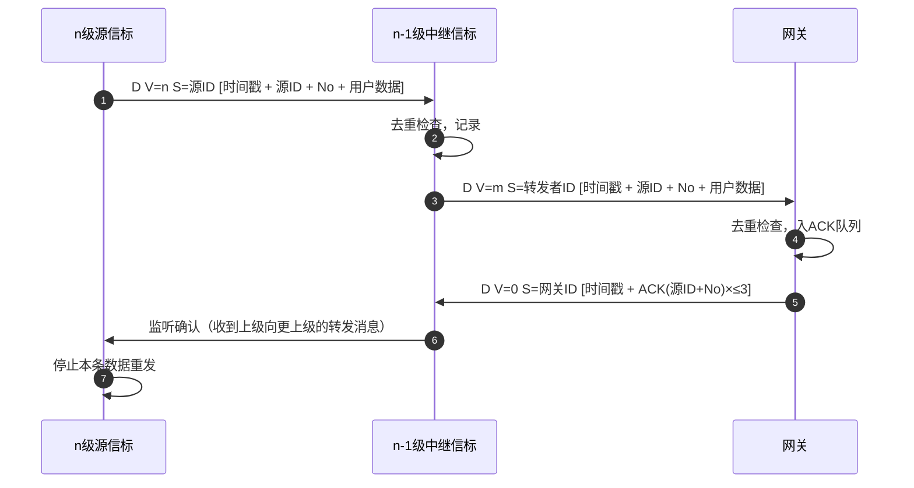

# 智能巡查系统自组网协议 — 软件设计文档

> 版本：v2（修订草案）
> 基准：`docs/智能巡查系统自组网协议-003.pdf`
> 实现：`lib/Ad-Hoc-lib/`

---

## 1. 概述

本文档描述智能巡查系统中网关（主机）与信标（标签）之间的自组网无线通信协议。协议基于 2.4GHz 射频链路，采用 TDMA 时分多址 + CSMA/CA 混合接入方式，支持：

- 分级组网（0 级网关 → n 级信标，多跳中继）
- 低功耗休眠与唤醒
- 数据上报、转发、去重与确认

### 1.1 节点角色

| 角色     | 功能                                                 |
| -------- | ---------------------------------------------------- |
| **网关** | 发起组网（0 级），维护拓扑，接收并应答数据，上送平台 |
| **信标** | 加入网络，采集上报，必要时中继转发下游数据           |

### 1.2 设计原则

- 单帧固定 32 字节，无动态内存分配
- 协议层与射频链路层解耦，可移植到不同硬件平台
- 同一时刻每个节点仅沿一个上行方向通信（多网关选一）

---

## 2. 帧格式

### 2.1 总体结构

所有无线帧固定 32 字节，按顺序排列：

| 偏移 | 长度 | 字段        | 说明                                       |
| ---- | ---- | ----------- | ------------------------------------------ |
| 0    | 1B   | **Header**  | 消息类别 + 网关号 + 时隙号                 |
| 1    | 1B   | **Level**   | 节点级别 V                                 |
| 2    | 5B   | **Sender**  | 发送者 ID（域号 11bit + 节点 ID 29bit）    |
| 7    | 24B  | **Content** | 帧类型相关的内容字段，以及2-4B的时间戳     |
| 31   | 1B   | **CRC8**    | 校验和（覆盖 Header+Level+Sender+Content） |

#### v2 变更说明

在**Content**字段新增2B-4B时间戳字段：北斗时间(BDT时间戳)（以2006年1月1日0时为起始历元，采用周和周内秒连续计数方式），存储为“自 2006 年以来的秒数”。

秒级精度时间戳用于标识采样时间。

**A 类帧: 4B 与协议头的时隙号合在一起表示以时隙为单位的当前时间（单位时隙）**
**D 类帧: 3B 的时间戳表示数据采用时间，最长跨度不超过一个月，最多31天（单位秒）**


### 2.2 Header 字节

位分配：

```
  bit 7        bits 6-4      bits 3-0
+-----------+---------------+-------------+
| msg_class |  gateway_no   |  slot_high4 |
+-----------+---------------+-------------+
```

- **msg_class**（1bit）：`0` = A 类（组网/管理帧），`1` = D 类（数据帧）
- **gateway_no**（3bit）：网关编号 0~7，用于多网关组网时区分方向
- **slot_high4**（4bit）：当前应答周期内的时隙序号高 4 位

#### 时隙奇偶匹配

时隙号（slot_high4 拼接低 8 位计数）的最低 bit 必须与 Level 字节的最低位同奇偶。同奇偶的时隙归同一类节点使用，减少相邻级别碰撞概率。

### 2.3 Level 字节

节点在拓扑中的级别：

- 网关固定为 `0`
- 信标入网后获得级别 `1`、`2`……`n`

### 2.4 Sender 字段（5 字节）

高 11 位为域号（`domain_id`），低 29 位为节点 ID（`node_id`），大端编码。

ID 分界规则：

| 范围                   | 含义        |
| ---------------------- | ----------- |
| `0`                    | 无效        |
| `1 ~ 1000000`          | **网关 ID** |
| `1000001 ~ 0x1FFFFFFF` | **信标 ID** |

### 2.5 CRC8

覆盖范围：Header + Level + Sender + Content（偏移 0~30，共 31 字节）。

参数：poly=0x07, init=0x00, xorout=0x00, refin=false, refout=false。

---

## 3. Content 格式

Content 为每类帧的专用数据区，长度固定 24 字节，不足补 0。

### 3.1 A 类帧（组网/管理）

#### 3.1.1 网关广播（A V=0）

网关从系统时间中，获取当前发送时间并转换成协议内的时间戳 **灵码标 LMT_A / LMT_D**

以微秒为单位的系统时间，把系统时间参考BDT格式分为：2006年1月1日0时0分0秒开始的秒数，及秒内的微秒。

具体到实际，从Header获取时隙号，从消息体里获取实际戳，转换RTC寄存器格式，同步时间。发送时则通过RTC寄存器获取时间，转换成协议时间戳。

| 位域      | 含义                |
| --------- | ------------------- |
| `0 ~24`   | 秒数 % $2^{25} $    |
| `25 ~ 31` | 周期  (秒内微秒/T5) |


网关在 0 时隙广播：

```
Content = LMT_A(4B) + 0填充 (20B)
```

#### 3.1.2 入网请求（A V=n, n≥1）

信标向上级发送入网请求：

```
Content = LMT_A(4B) + 上级ID(4B) + 0填充(16B)
```

上级 ID 的格式：

- **最高 3bit**：ID 标志（`0~5` = 对该上级的绑定编号；`6` = 已确认上级标记；`7` = 入网确认）
- **低 29bit**：上级的节点 ID

#### 3.1.3 确认应答（A V=0）

网关或上级节点对下级的确认消息，单帧最多确认 **5** 个下级（v2 因时间戳占用 2B 而缩减 1 条）：

```
Content = LMT_A(4B) + 应答ID1(4B) + 应答ID2(4B) + ... + 应答ID5(4B) 
```

每个应答 ID 格式同入网请求（3bit 标志 + 29bit 节点 ID），入网确认统一使用 `flag=7 + 子节点 ID`；下级请求时使用的绑定编号 `0~5` 不作为确认回显位。

#### 3.1.4 确认节点广播（A V=n）

已确认 n 级节点持续广播本级别消息以拉起下级：

```
Content = LMT_A(4B) + 已确认上级ID(flag=6, 4B) + 应答ID1..ID4(flag=7, 16B) 
```

最多容纳 **5 个 ID**（1 个已确认上级 + 4 个下级确认）。

### 3.2 D 类帧（数据）

#### 3.2.1 数据消息（D V=n）

```
Content = LMT_D(3B) + 数据源ID(4B) + 用户数据(17B)
```

| 字段         | 长度 | 说明                                                       |
| ------------ | ---- | ---------------------------------------------------------- |
| 时间戳 LMT_D | 3B   | 以秒为单位的采样时间，同时代表序号                         |
| 数据源 ID    | 4B   | 最高 3bit = ID 标志（原发/转发语义），低 29bit = 源节点 ID |
| 用户数据     | 17B  | 应用层载荷                                                 |

#### 3.2.2 网关数据 ACK（D V=0）

网关对收到的数据消息做批量确认，单帧最多确认 **3** 个数据消息（v2 因时间戳占用 2B 而缩减 1 条）：

```
Content = 应答1:源ID+LMT_D(7B) + 应答2:源ID+LMT_D(7B) + 应答3:源ID+LMT_D(7B) + 0填充(3B)
```

每条应答 7 字节：数据源 ID(4B) + 时间戳 LMT_D(3B)。无效槽位补 0。

#### 3.2.3 去重规则

`数据源 ID（node_id 部分）+ LMT_D` 构成消息的唯一标识。接收方在 6 小时窗口内对相同标识的数据仅处理一次。

---

## 4. ID 标志语义

| 取值  | 含义                                                                                      |
| ----- | ----------------------------------------------------------------------------------------- |
| `0~5` | **绑定编号**：未确认下级发给上级的回应，值 = 下级在该上级绑定表中的槽位号                 |
| `6`   | **已确认上级标记**：已确认节点在广播本级别时，将已确认上级的 ID 以此标志写入 content      |
| `7`   | **入网确认**：上级确认下级的入网请求时，以 `flag=7` + 下级节点 ID 写入 content（v2 新增） |

确认规则：子节点使用某个绑定编号 `N`（0~5）向上级请求入网，上级回复时**以 `id_flag=7` + 子节点 ID** 发出确认；子节点在收到的内容中扫描 `flag=7` 且 `node_id = 自身节点 ID` 的条目后转入已确认态。`flag=0~6` 均不得触发确认态转换。

---

## 5. 时序参数

### 5.1 参数定义

| 参数           | 说明                          | 推荐值               |
| -------------- | ----------------------------- | -------------------- |
| `T1`           | 时隙宽度（TMOS 625μs 整数倍） | 2500μs (4×625)       |
| `T2`           | 接收窗口时长                  | 57500μs (92×625)     |
| `T5 = T1 + T2` | 应答周期                      | 60000μs (96×625)     |
| `n = T5 / T1`  | 每个应答周期的时隙数          | 24                   |
| `T3`           | 探测侦听时间（必须 > T5）     | 62500μs (100×625)    |
| `T4`           | 探测休眠时间                  | 1937500μs (3100×625) |
| `T6 = T3 + T4` | 探测周期                      | 2000000μs (3200×625) |
| `m = T6 / T3`  | 探测等待倍数（建议 10~1000）  | 32                   |

### 5.2 时序关系

- 网关和已确认节点以 `T5` 为周期工作：在选定时隙发送信标，随后开启 `T2` 窗口接收应答
- 未入网信标以 `T6` 为周期探测：侦听 `T3`，休眠 `T4`
- 时隙选择在奇偶匹配的可用时隙内随机均匀分布

---

## 6. 状态机

### 6.1 状态转移图

 ```mermaid
stateDiagram-v2
    [*] --> ST0
    ST0 --> ST1: 外部触发（振动/上电）

    ST1 --> ST1: 侦听T3 / 休眠T4
    ST1 --> U1: 收到0级信标且信号合格
    ST1 --> UN: 收到n-1级信标且信号合格

    U1 --> C1: 收到网关确认(flag命中)
    U1 --> ST1: 30周期无确认
    UN --> CN: 收到上级确认(flag命中)
    UN --> ST1: 30周期无确认

    C1 --> C1: 广播1级信标
    C1 --> UN: 收到n-1级信标入更深级
    C1 --> ST1: 重组网到期 / 上游丢失

    CN --> CN: 广播n级信标
    CN --> ST1: 重组网到期 / 上游丢失
```





### 6.2 状态描述

| 状态    | 含义        | 行为                                         |
| ------- | ----------- | -------------------------------------------- |
| **ST0** | 深度休眠    | 出厂/闲置状态，外部触发后进入 ST1            |
| **ST1** | 等待组网    | 交替执行 T3 侦听 + T4 休眠，扫描可用信标     |
| **U1**  | 未确认 1 级 | 已满足信号条件，向网关发送入网请求，等待确认 |
| **UN**  | 未确认 n 级 | 同 U1，但向上级（n-1 级）请求入网            |
| **C1**  | 已确认 1 级 | 收到网关确认，持续广播 1 级信标以拉起下级    |
| **CN**  | 已确认 n 级 | 已确认的多级节点，持续广播 n 级信标          |

### 6.3 关键转换条件

- **ST1 → U1/UN**：收到本级或上级信标，信号强度满足候选条件（见第 7.1 节）
- **U1/UN → C1/CN**：30 周期内收到上级确认，且确认条目为 `flag=7 + 自身节点 ID`
- **U1/UN → ST1**：30 周期连续重试后仍未收到确认
- **C1/CN → ST1**：连续 3×T5 未收到上级信标（上游丢失），或重组网定时器到期

---

## 7. 入网与数据流程

### 7.1 信号强度条件

节点根据接收到的上级信标信号强度决定入网资格：

| 信号等级 | RSSI 阈值 | 判定条件                      |
| -------- | --------- | ----------------------------- |
| 强       | ≥ -65 dBm | 1 个应答周期内收到 1 次即合格 |
| 中       | ≥ -80 dBm | 2 个应答周期内至少收到 1 次   |
| 弱       | < -80 dBm | 4 个应答周期内至少收到 2 次   |

### 7.2 1 级入网时序



### 7.3 n 级入网流程（n ≥ 2）

与 1 级同构，将 0 级网关替换为 n-1 级已确认节点：



### 7.4 数据上报时序



### 7.5 转发规则

- **原发数据**：数据源 ID 的 flag 表示"可接收并转发的上级绑定编号"。源节点监听到任一上级转发后即停止重发。
- **转发数据**：`flag` 与本地 `upstream_no` 匹配时继续上送。转发节点监听到任一再转发后即停止本条数据重发。

### 7.6 数据重试

- 数据消息每个 T5 周期重发一次，最多 30 次
- 收到网关 ACK 后立即停止重发并清理队列
- 重试耗尽后通过 TX Report 通知应用层

### 7.7 数据确认机制的设计

协议的数据确认采用 **"网关 ACK + 监听确认" 双通道**，不实现逐级 ACK 下发。设计如下：

1. **组网三次握手已验证链路质量**：信标入网前经过信号强度判定，并在 30 周期内完成 `flag=7` 确认握手（U1/UN→C1/CN）。进入已确认态的链路可认为可靠连接。

2. **监听确认**：下级监听到上级向更上级转发同一条数据，即认为"本跳已送达"。核

3. **多上级设计**：组网阶段信标通过多条链路评估候选上级（多网关/多路径），监听确认成立。

4. **网关 ACK 为最终确认，不做逐级下行**：网关打包 ACK 帧广播后，中继节点只消费属于自己的 ACK 条目并清理队列，不向更下级转发。


---

## 8. 多网关与网络管理

### 8.1 多网关选择

- 信标可能收到多个网关方向的信标
- 优选规则：信号等级高 → RSSI 高 → 级别低 → gateway_no 小 → 上级 ID 小
- 选择并响应某个方向后，后续只处理该方向的帧，忽略其他方向

### 8.2 上游绑定表

每个信标维护 6 槽（编号 0~5）的上游绑定表：

- 每个槽记录一个可能的上游节点
- 入网时随机选取空闲槽位，使用该槽号作为请求时的 ID 标志
- 确认后固定该槽，后续通信使用同一编号

### 8.3 网络窗口

- 网关在组网阶段持续广播 A V=0
- 网络窗口超时后网关停止广播，锁定网络
- 信标侧继承首次观测到的窗口截止时间，到期后停止广播本级别信标

### 8.4 重组网

- 可设置重组网间隔（默认关闭）
- 启用后，已确认节点从进入确认态开始计时，到期回退 ST1
- 未启用重组网时，节点在连续 3×T5 内收不到上级信标也会回退 ST1

---

## 9. 驱动与接口约束

### 9.1 整体分层

```
┌──────────────────────────────────┐
│ 应用层（传感器采集、应用协议）      │
│ app/tasks                        |
├──────────────────────────────────┤
│ 网络层（Ad-Hoc 协议栈）           │
│ lib/Ad-Hoc-lib                   │
│ 帧组装/解析、状态机、数据面、去重   │
├─────────── 接口边界 ─────────────┤
│ 链路层（AROS-RF-LIB + 适配层）    │
│ lib/AROS-RF-LIB + adapters       │
│ 2.4GHz 射频收发、帧缓存、时戳      │
├──────────────────────────────────┤
│ 硬件层                           │
│ CH32V208 外设库、TMOS 调度器      │
└──────────────────────────────────┘
```

分层约定：
- **网络层**：本协议栈（`lib/Ad-Hoc-lib`），仅处理协议逻辑（帧组装/解析、状态机、数据面、去重），不直接访问 RF 硬件寄存器。
- **链路层**：当前基于 AROS-RF-LIB 实现固定信道收发。后期将在链路层开发信道频点切换功能（多信道跳频/避让），协议层（网络层）不感知信道变化，当前在同一信道验证即可。
- **硬件层**：CH32V208 外设库及 TMOS 任务调度器。

### 9.2 下行接口 ── 网络层 → 链路层

网络层通过适配层调用链路层

**关键约束**：
- 发送失败时链路层不负责重试，网络层通过 T5 周期自行重发
- 接收期间若帧 CRC8 校验失败，链路层丢弃不通知网络层
- 链路层提供多帧缓冲（≥4），避免连续帧丢失

### 9.3 上行接口 ── 链路层 → 网络层

链路层在接收窗口内每收到一个有效帧，立即通过回调注入网络层：

```c
void adhoc_node_on_rx(
    adhoc_node_t     *node,
    const uint8_t    *raw_frame,   // 32 字节完整帧
    int8_t            rssi,        // dBm 单位
    uint32_t          ts_us        // 接收时刻微秒时间戳
);
```

| 约束项     | 要求                                                   |
| ---------- | ------------------------------------------------------ |
| 帧长度     | 固定 32 字节，不作变长处理                             |
| RSSI       | 带符号 dBm 值（典型 -90 ~ -30），网络层据此做信号分级  |
| 时间戳     | 接收帧的精确微秒时间戳，用于时隙对齐和邻居记录         |
| 调用上下文 | 可在中断上下文或 TMOS 事件回调中调用，网络层内部无阻塞 |


### 9.4 上行接口 ── 网络层 → 应用层

网络层通过 `T_adhoc_evt_t` 事件通知应用层：

| 事件                      | 触发条件                   | 应用层处理               |
| ------------------------- | -------------------------- | ------------------------ |
| `ADHOC_EVT_STATE_CHANGED` | 状态机跃迁（ST1→U1→C1 等） | 更新 UI 指示灯，记录日志 |


### 9.5 下行接口 ── 应用层 → 网络层

应用层通过 `adhoc_api.h` 的公开接口驱动网络层：

| 接口                   | 约束                                                                             |
| ---------------------- | -------------------------------------------------------------------------------- |
| `adhoc_node_init(cfg)` | 启动时调用一次；`cfg` 指定 node_id、domain_id、时序参数 T1-T6、角色（网关/信标） |


---

## 10. 协议扩展记录

| 版本   | 日期           | 变更                                                                                                                                                 |
| ------ | -------------- | ---------------------------------------------------------------------------------------------------------------------------------------------------- |
| v1     | —              | 初始实现，数据帧 user 字段 18 字节，ACK 最多 4 条                                                                                                    |
| **v2** | **2026-05-02** | **时间戳为 Content 内字段（2B-4B）；确认应答最多 5 个下级（原 6），网关数据 ACK 最多 3 条（原 4）；user 字段调整为 16 字节；入网确认改用 id_flag=7** |

---

*文档结束*