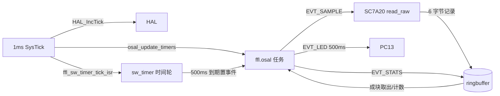

# stm32-base-driver：STM32F103C8T6 最小系统板示例

> 在 STM32F103C8T6 最小系统板（含 8MHz 晶振的一类 “blue pill” 板）上，
> 用 **本仓库的四个组件** 搭一个最小固件，展示真实工程里如何把它们接在一起。
> 组件全部来自仓库 `components/`，示例不复制、不改写组件实现，只提供应用层
> 与板级 port（见下文“目录”）。

演示组件与用途：

| 组件              | 在本示例里的作用                                                    | 仓库位置                                         |
| ----------------- | ------------------------------------------------------------------- | ------------------------------------------------ |
| `ffl.osal`        | 任务 + 事件 + reload 定时器；LED 心跳与统计上报都由 OSAL 定时器触发 | `components/runtime/osal`                        |
| `ffl.sw_timer`    | 时间轮软定时器；500ms 周期调度 SC7A20 采样                          | `components/foundation/sw-timer`                 |
| `ffl.sc7a20`      | 三轴加速度计；任务事件里同步读原始 x/y/z                            | `components/drivers/sensor/accelerometer/sc7a20` |
| `ffl.ringbuffer`  | 每次采样写 6 字节记录，统计事件成块取出                             | `components/foundation/ringbuffer`               |
| `ffl.driver_port` | （支撑）`ffl_transport_t`/`ffl_time_ops_t` 南向接口                 | `components/foundation/driver-port`              |

## 目录

```text
stm32-base-driver/
├── xmake.lua                  # 单固件 target：引用仓库组件 + STM32 SDK
├── readme.md
├── app/                       # 应用层（本示例逻辑，展示四个组件的用法）
│   ├── main.c                 # 初始化顺序 + 主循环
│   ├── app_task.h
│   └── app_task.c             # OSAL 任务：LED/采样/统计事件
├── bsp/                       # 板级 port（示例自有，只做“能力”不做组件实现）
│   ├── include/               # board.h, osal_port_stm32.h, stm32_time_ops.h, sc7a20_i2c_transport.h
│   └── src/
│       ├── board.c            # HAL/72MHz/LED/DWT/I2C1 初始化
│       ├── stm32f1xx_it.c     # SysTick: HAL + osal_update_timers + sw_timer tick
│       ├── osal_port_stm32.c  # 临界区（PRIMASK，嵌套安全）
│       ├── stm32_time_ops.c   # ffl_time_ops_t：delay_ms / delay_us / now_us(DWT)
│       ├── sc7a20_i2c_transport.c  # ffl_transport_t：HAL I2C1 轮询
│       ├── syscalls.c / sysmem.c   # newlib 支撑（CubeMX 生成）
│       └── stm32f1xx_hal_conf.h    # HAL 模块裁剪（含 I2C）
├── project/
│   └── STM32F103C8Tx_FLASH.ld      # 64K Flash / 20K RAM 链接脚本
└── sdk/                       # STM32F1 HAL + CMSIS（启动文件/时钟模板）
```

组件源码在 `xmake.lua` 里以仓库相对路径 `add_files()` 直接引用；southbound
port（I2C、时间、临界区）按 `ffl.driver_port` 契约实现在 `bsp/`。这与仓库
`ports/README.md` 的“最终固件 target 显式引用”约定一致。

## 接线（STM32F103C8T6 最小系统板）

板子必须带 **8MHz 外部晶振**（示例按 HSE×9=72MHz 配置时钟，与实板跑通工程一致）。

| 信号       | 引脚       | 说明                                                       |
| ---------- | ---------- | ---------------------------------------------------------- |
| SC7A20 VCC | 3V3        | 模块电源                                                   |
| SC7A20 GND | GND        | 共地                                                       |
| SC7A20 SCL | **PB6**    | I2C1_SCL（上拉到 3V3，模块通常自带）                       |
| SC7A20 SDA | **PB7**    | I2C1_SDA（上拉到 3V3，模块通常自带）                       |
| SC7A20 SDO | GND 或悬空 | 决定器件地址：SDO=GND -> `0x18`（默认），悬空/高 -> `0x19` |
| 板载 LED   | **PC13**   | 本示例按“低电平点亮”实现（标准 blue pill）                 |

> 若你的板子 LED 为高电平点亮，把 `bsp/src/board.c` 里
> `board_led_on/board_led_off` 的电平互换即可。
> 若 SC7A20 接不通，先在 `app/app_task.c` 把地址改成 `FFL_SC7A20_DEFAULT_ADDR7_H`（0x19）再试。

## 组件如何协作



- `bsp/src/stm32f1xx_it.c` 的 `SysTick_Handler`（1ms）同时喂给 HAL、OSAL、
  sw_timer 三套时基。
- 主循环（`app/main.c`）只做两件事：`osal_process_once()` + `ffl_sw_timer_process()`，
  再 `WFI` 睡到下一个 SysTick。
- OSAL reload 定时器驱动 `EVT_LED`（500ms 心跳）与 `EVT_STATS`（3s 统计）。
- sw_timer 500ms 到期回调给任务置 `EVT_SAMPLE`；任务里读 SC7A20 并把 6 字节
  原始数据写入 ringbuffer；统计事件成块取出记录字节数（`g_drained_bytes`）。

## 构建与烧录

前置：`xmake`、`arm-none-eabi` 工具链在 PATH（`arm-none-eabi-gcc`）。

```powershell
# 在仓库根目录执行；-P 指向示例工程
xmake f -P examples/stm32-base-driver -p cross --toolchain=arm-none-eabi -a arm -m release
xmake    -P examples/stm32-base-driver
```

产物：

```text
build/cross/arm/release/stm32-base-driver       # ELF
build/cross/arm/release/stm32-base-driver.bin   # 可直接烧录
```

烧录（任选其一）：

```powershell
# st-flash（ST-Link 克隆）
st-flash --connect-under-reset write build/cross/arm/release/stm32-base-driver.bin 0x08000000

# OpenOCD（按你的调试器/接口配置，示例参考 openocd.cfg 自行适配）
openocd -f interface/stlink.cfg -f target/stm32f1x.cfg -c "program build/cross/arm/release/stm32-base-driver.bin 0x08000000 verify reset exit"
```

## 验证现象

- **不接 SC7A20**：上电后 PC13 LED 每 500ms 翻转（OSAL reload 定时器 + 事件
  在跑）；sw_timer 仍在调度，采样槽把 0xFF 占位记录写进 ringbuffer，3s 统计会
  取空它——OSAL / sw_timer / ringbuffer 链路不依赖传感器也能自证运行。
- **接上 SC7A20**：器件初始化成功（`who_am_i=0x11`）后，`g_sample_ok_count`
  递增、`g_sample_err_count` 停住；采样记录（x/y/z int16 LE）进 ringbuffer，
  `g_drained_bytes` 每 3s 增加。用调试器观察这几个 `volatile` 计数器即可验证
  传感器数据流。

当前 **编译验证已完成**；真实板级现象请在板子上烧录后核对上表接线。
本示例沿用了实板工程（`D:\Desktop\stm32\test`）的时钟/LED/启动链路，但应用层
与本仓库 port 是独立实现，不属于该工程的功能迁移，实板结果以本次烧录为准。

## 改动点速查

| 想改什么                           | 位置                                                       |
| ---------------------------------- | ---------------------------------------------------------- |
| 采样周期（sw_timer）               | `app/app_task.c` 的 `SAMPLE_PERIOD_MS`                     |
| LED 心跳 / 统计周期（OSAL 定时器） | `app/app_task.c` 的 `LED_HEARTBEAT_MS` / `STATS_PERIOD_MS` |
| 量程 / 采样率                      | `app/app_task.c` 的 `config.range` / `config.odr`          |
| I2C 地址                           | `app/app_task.c`（SDO 电平）                               |
| I2C 速率/引脚                      | `bsp/src/sc7a20_i2c_transport.c`                           |
| LED 极性                           | `bsp/src/board.c`                                          |

## 资源占用（本机 arm-none-eabi 15.2 / release 实测）

```text
text    data    bss     dec     hex
18908   28      11492   30428   76dc    stm32-base-driver
```

Flash 约 19KB（64KB 可用）、RAM 约 11.5KB（20KB 可用）。BSS 大头是
OSAL 静态堆（8KB）与 sw_timer 时间轮（256 槽 × 4B ≈ 1KB）。
